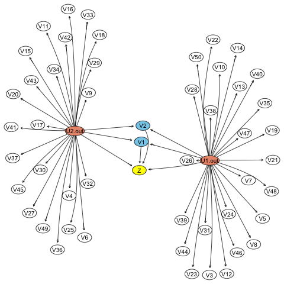
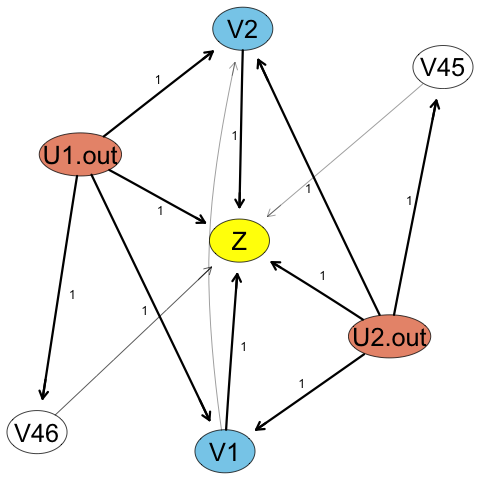
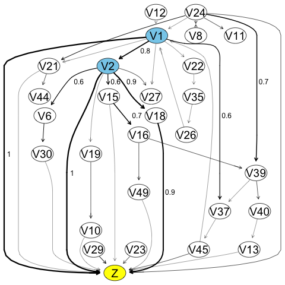
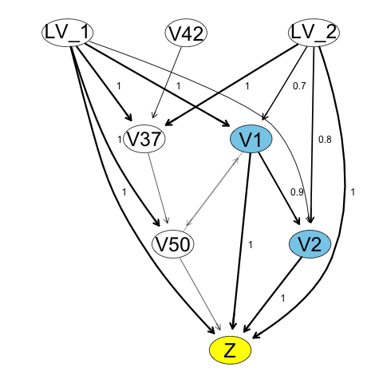
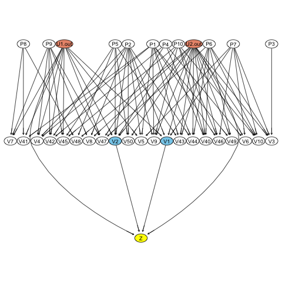
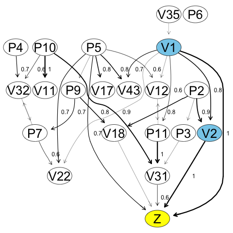
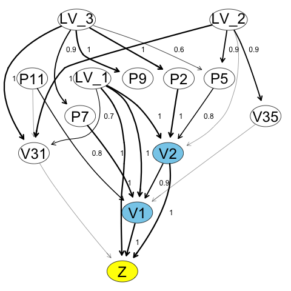
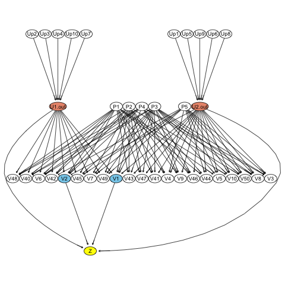
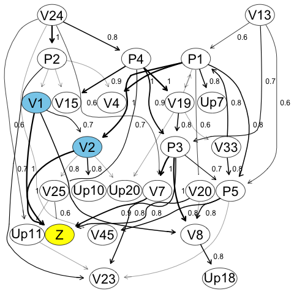
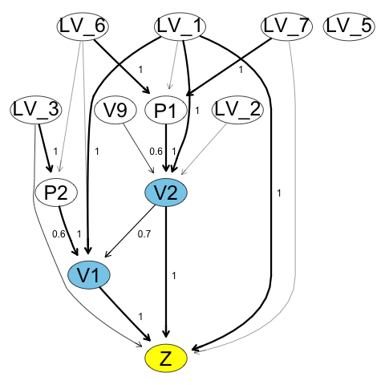

# Table of Contents

1.  [Simple Example](#org0f3abe8)
    1.  [Structure learning with no missing  variables](#orgd4c96b4)
    2.  [Reconstruction with missing confounders.](#orgdb7e165)
    3.  [Reconstruction estimating missing confounders](#org8430d22)
    4.  [Cleanup](#orgfae7551)
2.  [Medium Example](#org384702f)
    1.  [True network](#orgdbbb62d)
    2.  [Structure search with missing variables](#org5a336a0)
    3.  [Structure search estimating latent variables](#orge116b49)
3.  [Final Example](#org1717f98)
    1.  [Structure search with missing confounders.](#org589dd50)
    2.  [Reconstruction with estimated latent variables](#orge46a145)

---

# Simple Example

First we load the codes and dataset.
For the first example the true causal structure is shown below:

## Structure learning with no missing  variables

If we observe all the variables we can get a good estimate the graph structure:

    [1] "Distributing ensemble learning"
    Bootstrapping bnlearn 10 times.
    calculate coefficients

## Reconstruction with missing confounders.

Suppose that now we try to reconstruct the structure without observing U1.out and U2.out.
The resulting graph will be more complicated since many variables will try to compensate for the 
missing U1.out and U2.out.

## Reconstruction estimating missing confounders

Here we used the propose algorithm to learn the missing variables and improve the structure search.

## Cleanup

Close the parallelization cluster:

# Medium Example

## True network

## Structure search with missing variables

3

## Structure search estimating latent variables

# Final Example

## Structure search with missing confounders.

## Reconstruction with estimated latent variables

